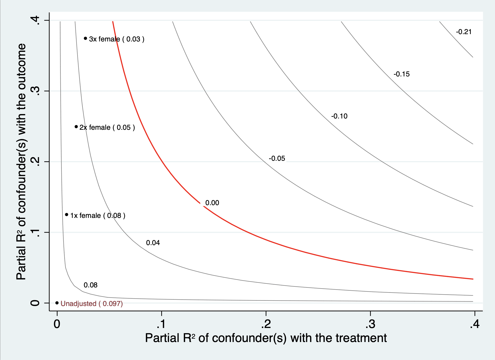
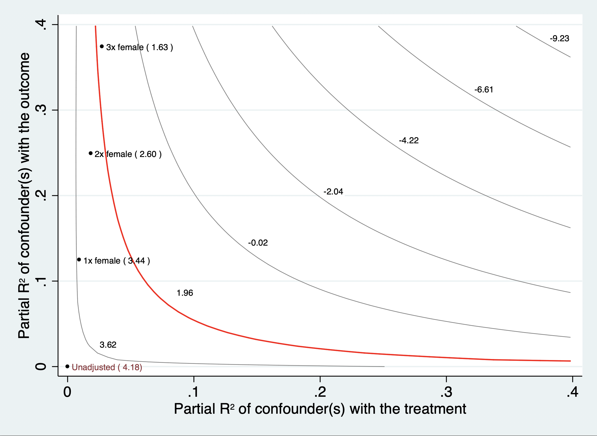
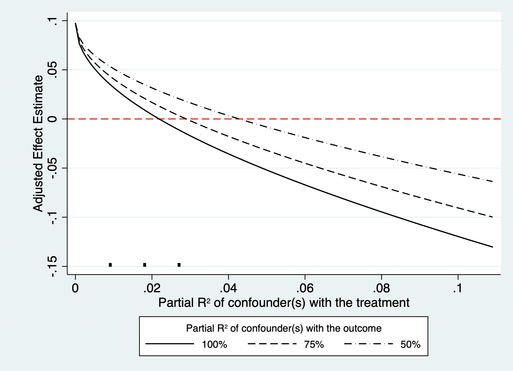

# sensemakr: Sensitivity Analysis Tools for OLS (Stata)  

`sensemakr` for Stata implements a suite of sensitivity analysis tools that
extends the traditional omitted variable bias framework and makes it
easier to understand the impact of omitted variables in regression
models, as discussed in [Cinelli, C. and Hazlett, C. (2020) “Making
Sense of Sensitivity: Extending Omitted Variable Bias.” Journal of the
Royal Statistical Society, Series B (Statistical
Methodology).](https://doi.org/10.1111/rssb.12348)


# Related Packages

  - Download the R package here:
    <https://github.com/carloscinelli/sensemakr/>

  - Check out the Robustness Value Shiny App at:
    <https://carloscinelli.shinyapps.io/robustness_value/>

    
# Installation

To install the current github version, run:

```
net install sensemakr, replace from("https://raw.githubusercontent.com/resonance1/sensemakr-stata/master/")
```

# Basic Usage

```
// Load dataset
use darfur.dta, clear

// Run sensitivity analysis, using female as a benchmark covariate:
sensemakr peacefactor directlyharmed age farmer_dar herder_dar pastvoted hhsize_darfur female ///
i.village_factor, treat(directlyharmed) benchmark(female)

// Generate a contour plot
sensemakr peacefactor directlyharmed age farmer_dar herder_dar pastvoted hhsize_darfur female ///
i.village_factor, treat(directlyharmed) benchmark(female) contourplot
```



```
// Generate a t-contour plot
sensemakr peacefactor directlyharmed age farmer_dar herder_dar pastvoted hhsize_darfur female ///
i.village_factor, treat(directlyharmed) benchmark(female) tcontourplot
```


 
```
// Generate an extreme scenario plot
sensemakr peacefactor directlyharmed age farmer_dar herder_dar pastvoted hhsize_darfur female ///
i.village_factor, treat(directlyharmed) benchmark(female) extremeplot 
```


